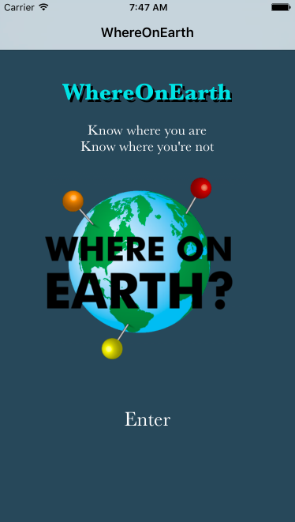
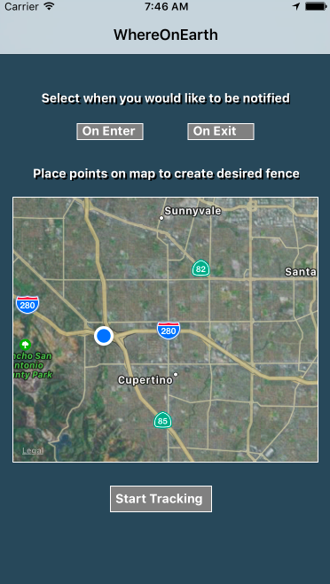
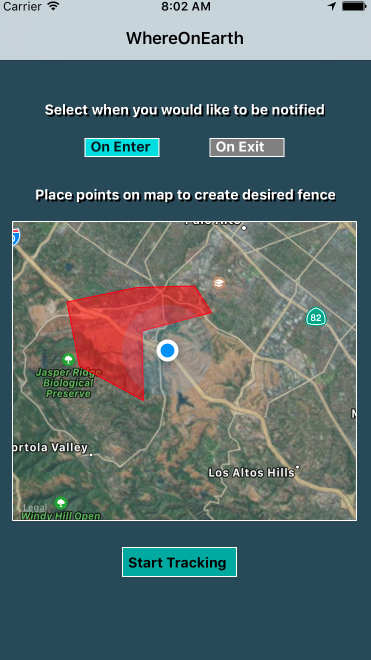
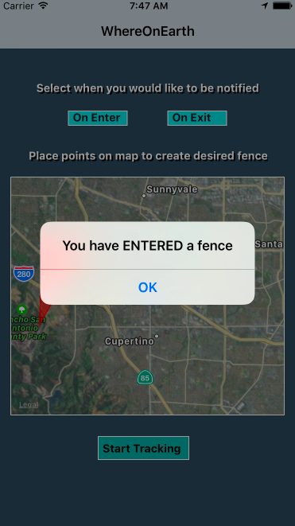

### Where on Earth?
Where on Earth is a geofencing app built for iOS using React Native. It allows users to create custom "geofences", or regions on a map, and receive alerts when they enter or exit these geofences.

Designed to work even in the absence of cell service, this app is useful for campers wanting to know when they are getting close to their campsite, hunters who risk fines for hunting outside of designated areas, or any outdoors enthusiast who could use a better sense of where they are in the backcountry.



#### Features and Implementation

###### Geolocation API

Where on Earth integrates the native geolocation API to keep the user's location accurate in real time.

```js
navigator.geolocation.getCurrentPosition(
  (position) => {
    this.setState({
      map: {
        position
      },
    });
  },
  (error) => alert(error.message),
  {enableHighAccuracy: true, timeout: 20000, maximumAge: 1000}

);
this.watchID = navigator.geolocation.watchPosition((currentPosition) => {
  this.setState({
                  prevPosition: this.state.currentPosition,
                  currentPosition: { lat: currentPosition.coords.latitude,
                                     lng: currentPosition.coords.longitude }
               });
});
```

**pic of notification asking to use location services**

It then displays the embedded google map, localized on the user's current location

```js
<MapView
  style={styles.map}
  mapType={MapView.MAP_TYPES.HYBRID}
  initialRegion={this.region}
  showsUserLocation = {true}
  onPress={e => this.props.onPress(e)}
  {...mapOptions}
  >
```


###### Complex Polygons

The map allows for intuitive creation of complex polygons representing the bounds of a geofence. It allows for the creation of unlimited distinct geofences.



###### Alert

It stores the lat/lng inputs from the user in a geofences slice of state, then runs a customized ray-casting algorithm every time the user's location changes in order to determine if their current location falls within any of the fences they created, then alerts the user based on preferences they set.

```js
containsLocation(point, polygon) {
  let x = point['lat'], y = point['lng'];

  let inside = false;
  for (let i = 0, j = polygon.length - 1; i < polygon.length; j = i++) {
      let xi = polygon[i]['lat'], yi = polygon[i]['lng'];
      let xj = polygon[j]['lat'], yj = polygon[j]['lng'];

      let intersect = ((yi > y) != (yj > y))
          && (x < (xj - xi) * (y - yi) / (yj - yi) + xi);
      if (intersect) inside = !inside;
  }

  return inside;
};
```

```js
this.state.geoFences.forEach(fence => {
  let prevPoint = this.state.prevPosition;
  let currentPoint = this.state.currentPosition;
  if (this.containsLocation(currentPoint, fence) &&
      !this.containsLocation(prevPoint, fence) &&
      this.state.form.onEnter) {
        Alert.alert('You have ENTERED a fence');
  }
  if (this.containsLocation(prevPoint, fence) &&
      !this.containsLocation(currentPoint, fence) &&
      this.state.form.onExit) {
        Alert.alert('You have EXITED a fence')
  }
})
```



#### Future Development
Where on Earth has many plans for the future including:
- 
